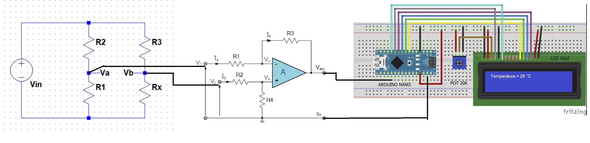
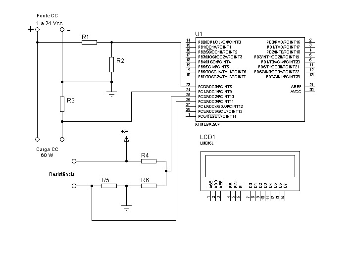

# **Instrumentação** - POLI / UPE

*Repositório destinado ao armazenamento e compartilhamento dos projetos dos alunos do Grupo 01 referentes a disciplina de Instrumentação, orientada pelo Prof. Diogo Roberto Raposo, durante o período de 2023.1.*

## Projeto 01: **Termômetro Digital**

### **Hardware Proposto:**

- [Arquivo de Simulação no Proteus](Projeto01_Termometro_Digital/hardware/Simulacao_Proteus/TermometroDigital.pdsprj)

### **Firmware:**
[Clique aqui](Projeto01_Termometro_Digital/firmware/firmware_termometro_digital/firmware_termometro_digital.ino) para acessar o firmware do Termômetro Digital.

## Projeto 02: **Multímetro Digital**

### **Hardware Proposto:**

### **Firmware:**
[Clique aqui](Projeto02_Multimetro_Digital/firmware/firmware_multimetro/firmware_multimetro.ino) para acessar o firmware do Multímetro Digital.